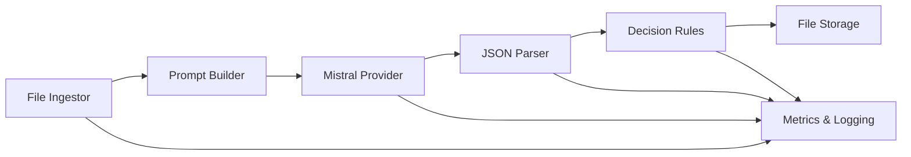

# vis2attr

**Visual Language Model for Attribute Extraction**

Turn item photos into structured attributes (brand, colors, materials, condition) using Visual Language Models. Output strict JSON with per-field confidence scores.

## Current Status: MVP Implementation

This project is currently in **MVP development phase** with core infrastructure implemented and ready for pipeline integration.

### ✅ Implemented Features

- **Core Data Models**: Complete schema definitions for Item, VLMRequest, VLMRaw, Attributes, and Decision
- **Configuration System**: YAML-based configuration with schema validation
- **CLI Interface**: `analyze` and `report` commands (framework ready)
- **File System Ingestor**: Image loading, processing, and validation with EXIF stripping
- **Mistral AI Provider**: Full implementation with vision model support
- **JSON Parser**: Structured response parsing with confidence extraction
- **File Storage Backend**: Local storage with organized directory structure
- **Factory Patterns**: Pluggable architecture for providers, parsers, and storage
- **Schema System**: YAML-based attribute schemas with Jinja2 prompt templates
- **Comprehensive Testing**: Full test suite covering all implemented components

### 🚧 In Development

- **Pipeline Integration**: Connecting all components into working pipeline
- **Additional Providers**: OpenAI, Google, Anthropic (Mistral currently implemented)
- **Decision Rules Engine**: Quality thresholds and acceptance logic
- **Metrics & Logging**: Observability and performance tracking
- **Report Generation**: Analysis and quality reporting functionality

### 📋 Planned Features

- **URL/API Ingestors**: Remote image loading
- **Advanced Parsers**: Support for different response formats
- **Web API**: RESTful interface for production use

## Architecture Overview



### Component Status

| Component | Status | Implementation |
|-----------|--------|----------------|
| **File Ingestor** | ✅ Complete | Image loading, processing, EXIF stripping |
| **Prompt Builder** | ✅ Complete | Jinja2 templates with schema integration |
| **Mistral Provider** | ✅ Complete | Full VLM integration with cost tracking |
| **JSON Parser** | ✅ Complete | Structured response parsing |
| **Decision Rules** | 🚧 Planned | Quality thresholds and acceptance logic |
| **File Storage** | ✅ Complete | Organized local storage with lineage |
| **Metrics & Logging** | 🚧 Planned | Performance and cost tracking |

## Data Models

The system uses well-defined data contracts for type safety and consistency:

* **Item**: `{ item_id: str, images: List[bytes], meta: Dict[str, Any] }`
* **VLMRequest**: `{ model: str, messages: List[Dict], images: List[bytes], max_tokens: int, temperature: float }`
* **VLMRaw**: `{ content: str, usage: Dict[str, Any], latency_ms: float, provider: str, model: str, timestamp: datetime }`
* **Attributes**: `{ data: Dict[str, Any], confidences: Dict[str, float], tags: Set[str], notes: str, lineage: Dict[str, Any] }`
* **Decision**: `{ accepted: bool, field_flags: Dict[str, str], reasons: List[str], confidence_score: float }`

> `Attributes.data` is a dict to support any custom schema loaded at runtime.

## Default Schema

The system uses a YAML-based schema definition:

```yaml
brand:
  value: null
  confidence: 0.0

model_or_type:
  value: null
  confidence: 0.0

primary_colors:
  - name: ""
    confidence: 0.0

materials:
  - name: ""
    confidence: 0.0

condition:
  value: null
  confidence: 0.0

notes: ""
```

## Configuration

The system uses a single YAML configuration file (`config/project.yaml`):

```yaml
# Pipeline components
ingestor: ingest.fs  # File system ingestor
provider: providers.mistral  # Mistral AI provider
storage: storage.files  # Local file storage

# Schema and prompts
schema_path: config/schemas/default.yaml
prompt_template: config/prompts/default.jinja

# Decision thresholds
thresholds:
  default: 0.75
  brand: 0.80
  model_or_type: 0.70
  primary_colors: 0.65
  materials: 0.70
  condition: 0.75

# I/O settings
io:
  max_images_per_item: 3
  max_resolution: 768
  supported_formats: [".jpg", ".jpeg", ".png", ".webp"]

# Provider settings
providers:
  mistral:
    model: "pixtral-12b-latest"
    max_tokens: 1000
    temperature: 0.1
```

## Installation & Setup

```bash
# Clone and install
git clone <repository>
cd vis2attr
uv venv && source .venv/bin/activate
uv pip install -e .

# Set up API key
export MISTRAL_API_KEY=your_api_key_here

# Run analysis (when pipeline is complete)
vis2attr analyze --input ./images --config config/project.yaml --output ./predictions.parquet
vis2attr report --predictions ./predictions.parquet
```

## Project Structure

```
vis2attr/
├── config/
│   ├── project.yaml          # Main configuration
│   ├── schemas/default.yaml  # Attribute schema
│   └── prompts/default.jinja # Prompt template
├── src/vis2attr/
│   ├── core/                 # Data models and config
│   ├── cli/                  # Command-line interface
│   ├── ingest/               # Image loading (fs.py)
│   ├── providers/            # VLM providers (mistral.py)
│   ├── parse/                # Response parsing (json_parser.py)
│   ├── storage/              # Data persistence (files.py)
│   └── prompt/               # Template system
├── tests/                    # Comprehensive test suite
└── storage/                  # Local data storage
```

## Development Status

This project is in active development. The core infrastructure is complete and ready for pipeline integration. The next major milestone is connecting all components into a working end-to-end pipeline.

### Key Design Principles

- **Schema-first & config-driven**: No hard-coded fields
- **Ports & adapters**: Swappable implementations via factory patterns
- **Stateless modules**: Side-effects isolated in storage
- **Type safety**: Comprehensive data models with validation
- **Testability**: Full test coverage for all components
