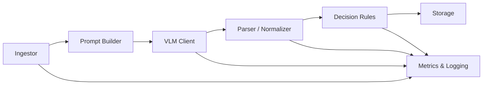

Here’s a **minimalist MVP architecture doc** for **vis2attr**—focused on general concepts, modularity, and a clean path to scale.

# 1) Purpose

Turn a few item photos into **structured attributes** (e.g., brand, colors, materials) using a **Visual Language Model (VLM)**. Output strict JSON, per-field confidence, and “unknown” when unsure.

# 2) Scope (MVP)

* VLM-only pipeline (no custom CV training).
* Local-first (CLI), optional lightweight API later.
* Pluggable **schema**, **ingestors**, **providers**, **storage** via config.

# 3) Core principles

* **Schema-first & config-driven** (no hard-coding fields).
* **Ports & adapters** (hexagonal): stable interfaces; swappable implementations.
* **Stateless, small modules**; side-effects isolated in storage/logging.
* **Observability by default** (metrics, cost, latency).

# 4) System overview (blocks)



## Block roles (generic)

* **Ingestor**: load images (fs/urls/api), basic QC/resize → `Item`.
* **Prompt Builder**: schema + template + images → `VLMRequest`.
* **VLM Client**: provider adapter (OpenAI/Gemini/Claude) → `VLMRaw`.
* **Parser/Normalizer**: safe JSON parse, coerce to schema, map values → `Attributes`.
* **Decision Rules**: thresholds/tags, accept vs needs\_review → `Decision`.
* **Storage**: write outputs/lineage (JSONL/Parquet now; S3/DB later).
* **Metrics & Logging**: latency, coverage, cost, flags; structured logs.

# 5) Data contracts (high-level)

* **Item**: `{ item_id, images:[bytes|uri], meta:{} }`
* **VLMRequest**: `{ model, messages, images, max_tokens, temperature }`
* **VLMRaw**: `{ content:str, usage:{tokens…}, latency_ms }`
* **Attributes**: `{ data: dict, confidences: {field: float}, tags: set, notes, lineage }`
* **Decision**: `{ accepted: bool, field_flags: {field:reason}, reasons: [str] }`

> `Attributes.data` is a dict so any **custom schema** can be loaded at runtime.

# 6) Minimal schema example (generic)

```json
{
  "brand": {"value": null, "confidence": 0.0},
  "model_or_type": {"value": null, "confidence": 0.0},
  "primary_colors": [{"name": "", "confidence": 0.0}],
  "materials": [{"name": "", "confidence": 0.0}],
  "condition": {"value": null, "confidence": 0.0},
  "notes": ""
}
```

# 7) Configuration (single source of truth)

* `project.yaml`

  * `ingestor: ingest.fs | ingest.urls | ingest.api`
  * `provider: providers.openai | providers.google | providers.anthropic`
  * `storage: storage.files | storage.s3`
  * `schema_path: config/schemas/<domain>.yaml`
  * `prompt_template: config/prompts/default.jinja`
  * `thresholds: { default: 0.75, brand: 0.80, ... }`
  * `io: { max_images_per_item: 3, max_resolution: 768 }`

# 8) Control flow (MVP)

1. **Load** images → `Item`
2. **Build prompt** from schema/template → `VLMRequest`
3. **Call VLM** → `VLMRaw`
4. **Parse/normalize** → `Attributes`
5. **Decide** (thresholds/tags) → `Decision`
6. **Persist** outputs + lineage; **emit metrics**

# 9) Interfaces (swap points)

```python
class Ingestor:  def load(self, source) -> Item: ...
class Provider:  def predict(self, req: VLMRequest) -> VLMRaw: ...
class Storage:   def write(self, item: Item, attrs: Attributes, dec: Decision) -> str: ...
```

# 10) Observability (minimum)

* **Metrics:** coverage (% non-unknown), p50/p95 latency, tokens/item, \$/item (est.), % flagged.
* **Logs:** JSON logs with `request_id`, `item_id`, provider, timing, warnings (no PII).
* **Report CLI:** aggregates metrics; fails CI if below gates.

# 11) Non-goals (MVP)

* No custom training, no segmentation/detection.
* No hard dependency on a single provider.
* No complex workflow engine (simple, linear pipeline).

# 12) Security & data hygiene (lightweight)

* API keys via env; `.env.example` for local.
* Strip EXIF; avoid faces/PII; don’t log image bytes.
* If remote images, use signed URLs; delete temp files after processing.

# 13) Minimal repo scaffold

```
vis2attr/
  pyproject.toml
  README.md
  config/{project.yaml, schemas/, prompts/, palettes/}
  src/vis2attr/
    core/{schemas.py, config.py}
    ingest/{fs.py, urls.py, api.py}
    prompt/{templates/, builder.py}
    providers/{openai.py, google.py, anthropic.py, factory.py}
    parse/{parser.py, normalizer.py}
    rules/decider.py
    storage/{files.py, s3.py}
    metrics/{metrics.py, logging.py}
    cli/{analyze.py, report.py}
  tests/
```

# 14) MVP KPIs (go/no-go)

* **Quality:** coverage ≥ 80% on a 200-item golden set.
* **Latency:** p95 ≤ 3s per item (2–3 images).
* **Reliability:** 0 schema violations; <1% API error after retries.
* **Cost clarity:** real \$/item measured on pilot.

# 15) Quickstart (operator view)

```bash
uv venv && source .venv/bin/activate
uv pip install -e .
export PROVIDER_API_KEY=...
vis2attr analyze --input ./images --config config/project.yaml --out ./predictions.parquet
vis2attr report  --pred ./predictions.parquet
```

---

**MVP essence:** a small, schema-driven pipeline of interchangeable blocks. Change domain, provider, or storage by changing config—not code.
