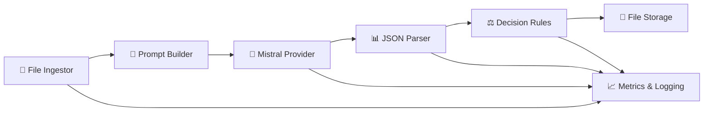

# vis2attr

[](https://www.python.org/downloads/)
[](https://opensource.org/licenses/MIT)
[](https://github.com/psf/black)

**Visual Language Model for Attribute Extraction**

Turn item photos into structured attributes (brand, colors, materials, condition) using Visual Language Models. Output strict JSON with per-field confidence scores.

## 🚀 Quick Start

```bash
# Install
uv venv && source .venv/bin/activate
uv pip install -e .

# Set up API key
export MISTRAL_API_KEY=your_api_key_here

# Run analysis
vis2attr analyze --input ./images --output ./predictions.parquet
```

## 📊 Status

**Core infrastructure complete** with working pipeline. Ready for production improvements.

| Status | Component | Description |
|--------|-----------|-------------|
| ✅ | **Core Pipeline** | Complete data models, configuration, Mistral provider, JSON parser |
| ✅ | **File Processing** | Image ingestor with EXIF stripping, comprehensive test suite |
| 🚧 | **CLI Interface** | Basic commands need UX improvements and error handling |
| 🚧 | **Storage System** | File-based storage needs query interface and better organization |
| 🚧 | **Decision Rules** | Simple thresholds only, needs sophisticated quality gates |
| ❌ | **Report Generation** | Placeholder only, needs full implementation |
| ❌ | **Metrics & Logging** | No observability or performance tracking |
| ❌ | **Additional Providers** | Only Mistral (need OpenAI, Google, Anthropic) |

## 🏗️ Architecture




## 📊 Data Models

Well-defined data contracts for type safety and consistency:

```python
# Core data structures
Item = {
    item_id: str,
    images: List[bytes], 
    meta: Dict[str, Any]
}

Attributes = {
    data: Dict[str, Any],           # Schema-driven attributes
    confidences: Dict[str, float],  # Per-field confidence scores
    tags: Set[str],                 # Classification tags
    notes: str,                     # Additional notes
    lineage: Dict[str, Any]         # Processing metadata
}

Decision = {
    accepted: bool,                 # Overall acceptance
    field_flags: Dict[str, str],    # Per-field status
    reasons: List[str],             # Rejection reasons
    confidence_score: float         # Overall confidence
}
```

> `Attributes.data` supports any custom schema loaded at runtime.

## ⚙️ Configuration

YAML-based schema definition and project configuration:

```yaml
# Pipeline components
ingestor: ingest.fs
provider: providers.mistral
storage: storage.files

# Schema and prompts
schema_path: config/schemas/default.yaml
prompt_template: config/prompts/default.jinja

# Decision thresholds
thresholds:
  default: 0.75
  brand: 0.80
  model_or_type: 0.70
  primary_colors: 0.65
  materials: 0.70
  condition: 0.75

# I/O settings
io:
  max_images_per_item: 3
  max_resolution: 768
  supported_formats: [".jpg", ".jpeg", ".png", ".webp"]

# Provider settings
providers:
  mistral:
    model: "pixtral-12b-latest"
    max_tokens: 1000
    temperature: 0.1
```

### Default Schema
```yaml
brand:
  value: null
  confidence: 0.0

model_or_type:
  value: null
  confidence: 0.0

primary_colors:
  - name: ""
    confidence: 0.0

materials:
  - name: ""
    confidence: 0.0

condition:
  value: null
  confidence: 0.0

notes: ""
```


## 📁 Project Structure

```
vis2attr/
├── config/                   # Configuration files
├── src/vis2attr/            # Source code
│   ├── core/                # Data models and config
│   ├── cli/                 # Command-line interface
│   ├── ingest/              # Image loading
│   ├── providers/           # VLM providers
│   ├── parse/               # Response parsing
│   ├── storage/             # Data persistence
│   └── prompt/              # Template system
├── tests/                   # Test suite
└── storage/                 # Local data storage
```
## 🎯 Design Principles

- **Schema-first & config-driven**: No hard-coded fields
- **Ports & adapters**: Swappable implementations via factory patterns
- **Type safety**: Comprehensive data models with validation
- **Testability**: Full test coverage for all components

---

## 🤝 Contributing

Contributions are welcome! Please feel free to submit a Pull Request.

## 📄 License

This project is licensed under the MIT License - see the [LICENSE](LICENSE) file for details.
