# vis2attr - Vision Language Model for Attribute Extraction framework

[](https://www.python.org/downloads/)
[](https://opensource.org/licenses/MIT)
[](https://github.com/psf/black)

Turn item photos into structured attributes (brand, colors, materials, condition) using Visual Language Models. Output strict JSON with per-field confidence scores.

## High-Level Architecture

```mermaid
flowchart LR
    A[📁 Images<br/>JPG/PNG/WebP] --> B[📝 Prompt<br/>Jinja2]
    B --> C[🤖 VLM<br/>Mistral/OpenAI]
    C --> D[📊 Parse<br/>JSON]
    D --> E[⚖️ Decide<br/>Thresholds]
    E --> F[💾 Store<br/>Parquet]
    F --> G[📈 Export<br/>CLI]
    
    CONFIG[⚙️ Config<br/>YAML] --> B
    CONFIG --> C
```



## 🚀 Quick Start

```bash
# Install
uv venv && source .venv/bin/activate
uv pip install -e .

# Set up API key
export MISTRAL_API_KEY=your_api_key_here

# Run analysis
vis2attr analyze --input ./images --output ./predictions.parquet

# Batch processing with custom config
vis2attr analyze --input ./items --batch --config ./my-config.yaml --verbose

# Generate reports
vis2attr report --predictions ./predictions.parquet --format summary
```

## 📊 Status

**Core infrastructure complete** with working pipeline. Ready for production improvements.

| Status | Component | Description |
|--------|-----------|-------------|
| ✅ | **Core Pipeline** | Complete data models, configuration, Mistral provider, JSON parser |
| ✅ | **File Processing** | Image ingestor with EXIF stripping, comprehensive test suite |
| ✅ | **CLI Interface** | Full analyze command with batch processing, verbose logging, and result export |
| ✅ | **Storage System** | Parquet-based storage with lineage tracking and metadata storage |
| 🚧 | **Decision Rules** | Simple threshold-based decisions, needs sophisticated quality gates |
| 🚧 | **Report Generation** | CLI command structure ready, needs full implementation |
| ❌ | **Metrics & Logging** | Basic logging only, needs structured metrics collection |
| ❌ | **Additional Providers** | Only Mistral implemented (OpenAI, Google, Anthropic planned) |

## 📚 Documentation

- **[Architecture](docs/architecture.md)** - System design, data flow, and component overview
- **[CLI Reference](docs/cli.md)** - Complete command-line interface documentation
- **[Configuration](docs/configuration.md)** - Configuration options and schema definitions
- **[API Reference](docs/api.md)** - Data models, schemas, and programming interface
- **[Contributing](CONTRIBUTING.md)** - Development guidelines and contribution process

## 🎯 Design Principles

- **Schema-first & config-driven**: No hard-coded fields
- **Ports & adapters**: Swappable implementations via factory patterns
- **Type safety**: Comprehensive data models with validation
- **Testability**: Full test coverage for all components

---

## 🤝 Contributing

Contributions are welcome! Please feel free to submit a Pull Request.

## 📄 License

This project is licensed under the MIT License - see the [LICENSE](LICENSE) file for details.
