# Architecture

## System Overview

vis2attr is a schema-driven pipeline for extracting structured attributes from product images using Visual Language Models (VLMs). The system follows a ports & adapters architecture pattern, enabling easy swapping of components and providers.

## High-Level Architecture

```mermaid
flowchart LR
    A[📁 Images<br/>JPG/PNG/WebP] --> B[📝 Prompt<br/>Jinja2]
    B --> C[🤖 VLM<br/>Mistral/OpenAI]
    C --> D[📊 Parse<br/>JSON]
    D --> E[⚖️ Decide<br/>Thresholds]
    E --> F[💾 Store<br/>Parquet]
    F --> G[📈 Export<br/>CLI]
    
    CONFIG[⚙️ Config<br/>YAML] --> B
    CONFIG --> C
```



## Component Details

### Input Layer

**File System Ingestor** (`src/vis2attr/ingest/fs.py`)
- Loads images from filesystem
- Strips EXIF data for privacy
- Validates image formats and dimensions
- Supports JPG, PNG, WebP formats
- Configurable image limits and resolution

### Configuration Layer

**Configuration Management** (`src/vis2attr/core/config.py`)
- YAML-based configuration
- Schema-driven attribute definitions
- Provider-specific settings
- Threshold configuration
- Security and I/O settings

**Prompt Builder** (`src/vis2attr/prompt/builder.py`)
- Jinja2 template rendering
- Schema integration
- Dynamic VLM request creation
- Multi-provider support

### Processing Pipeline

**VLM Providers** (`src/vis2attr/providers/`)
- Abstract provider interface
- Mistral implementation (complete)
- OpenAI, Google, Anthropic (planned)
- Factory pattern for provider selection
- Cost estimation and rate limiting

**JSON Parser** (`src/vis2attr/parse/service.py`)
- Response validation
- Schema compliance checking
- Confidence score extraction
- Error handling and recovery

**Decision Engine** (`src/vis2attr/pipeline/service.py`)
- Threshold-based quality gates
- Field-level validation
- Overall confidence scoring
- Rejection reasoning

### Storage Layer

**Parquet Storage** (`src/vis2attr/storage/parquet.py`)
- Efficient columnar storage
- Attributes, raw responses, and lineage
- Metadata tracking
- Query-friendly format

### Output Layer

**CLI Interface** (`src/vis2attr/cli/`)
- Analyze command with batch processing
- Report generation
- Verbose logging
- Error reporting and statistics

## Data Flow

1. **Ingestion**: Images loaded from filesystem with metadata extraction
2. **Configuration**: Schema and provider settings loaded
3. **Prompt Building**: VLM request created with images and schema
4. **VLM Processing**: Request sent to provider, response received
5. **Parsing**: JSON response validated and structured
6. **Decision**: Quality gates applied, acceptance determined
7. **Storage**: Results stored with lineage tracking
8. **Export**: CLI outputs results and statistics

## Design Patterns

### Ports & Adapters
- Abstract interfaces for all major components
- Easy swapping of implementations
- Testable with mock implementations

### Factory Pattern
- Provider factory for VLM selection
- Storage factory for backend selection
- Dynamic component instantiation

### Configuration-Driven
- No hard-coded field definitions
- Runtime schema loading
- Flexible threshold configuration

## Project Structure

```
vis2attr/
├── config/                   # Configuration files
│   ├── project.yaml         # Main configuration
│   ├── schemas/             # Schema definitions
│   └── prompts/             # Jinja2 templates
├── src/vis2attr/            # Source code
│   ├── core/                # Data models, config, exceptions
│   ├── cli/                 # Command-line interface (analyze, report)
│   ├── ingest/              # File system ingestor
│   ├── providers/           # VLM providers (Mistral implemented)
│   ├── parse/               # JSON response parsing
│   ├── pipeline/            # Main orchestration service
│   ├── prompt/              # Jinja2 template builder
│   ├── storage/             # Parquet storage backend
│   ├── rules/               # Decision rules (placeholder)
│   └── metrics/             # Metrics collection (placeholder)
├── tests/                   # Comprehensive test suite
├── storage.parquet          # Default output storage
└── main.py                  # CLI entry point
```

## Future Enhancements

### Planned Components
- **Advanced Decision Rules**: ML-based quality gates
- **Metrics & Logging**: Structured observability
- **Additional Providers**: OpenAI, Google, Anthropic
- **Report Generation**: Rich analytics and visualizations
- **API Server**: REST/GraphQL endpoints
- **Web UI**: Browser-based interface
